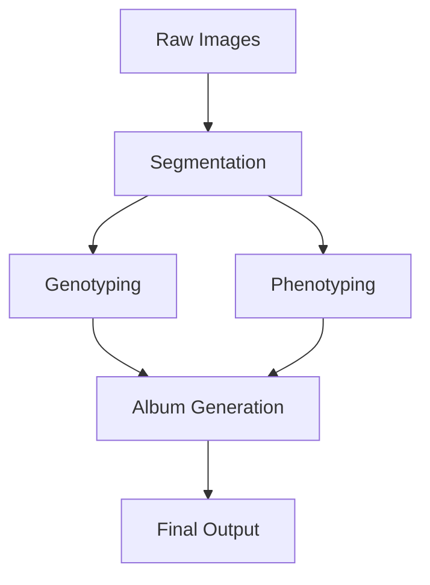

# Pipeline Organization

## Class Hierarchy

### Base Classes
```
Pipeline (core/pipeline.py)
├── SegmentationPipeline (core/segmentation/base.py)
│   ├── Segmentation10XPipeline
│   └── Segmentation40XPipeline
├── GenotypingPipeline (core/genotyping/base.py)
├── PhenotypingPipeline (core/phenotyping/base.py)
└── AlbumGenerationPipeline (core/visualization/albums.py)
```

### Utility Classes
```
BatchProcessor (utils/parallel.py)
├── process_serial()
└── process_parallel()

ImageLoader (utils/io.py)
├── load_nd2_image()
└── load_cycles_for_tile()

TileInfo (utils/io.py)
├── get_tile_coordinates()
└── arrange_tiles()

Visualizer (core/visualization/plots.py)
├── plot_reads()
├── create_quality_plots()
└── plot_coordinate_mapping()
```

## Function Cohesion

### Segmentation Module
- **Purpose**: Cell and nuclei segmentation from microscopy images
- **Key Classes**:
  - `CellSegmentation`: Core segmentation algorithms
  - `Segmentation10XPipeline`: 10X magnification specific pipeline
  - `Segmentation40XPipeline`: 40X magnification specific pipeline
- **Function Groups**:
  ```
  Segmentation
  ├── Image Preprocessing
  │   ├── normalize_image()
  │   └── enhance_contrast()
  ├── Nuclear Segmentation
  │   ├── segment_nuclei()
  │   └── clean_nuclear_mask()
  └── Cell Segmentation
      ├── segment_cells()
      └── clean_cell_mask()
  ```

### Genotyping Module
- **Purpose**: Barcode identification and assignment
- **Key Classes**:
  - `Genotyper`: Core genotyping algorithms
  - `GenotypingPipeline`: End-to-end genotyping workflow
- **Function Groups**:
  ```
  Genotyping
  ├── Peak Analysis
  │   ├── find_peaks()
  │   └── call_bases()
  └── Barcode Assignment
      ├── assign_barcodes()
      └── validate_assignments()
  ```

### Phenotyping Module
- **Purpose**: Cell phenotype measurement and analysis
- **Key Classes**:
  - `Phenotyper`: Core phenotyping algorithms
  - `PhenotypingPipeline`: End-to-end phenotyping workflow
- **Function Groups**:
  ```
  Phenotyping
  ├── Morphology Metrics
  │   ├── calculate_area_metrics()
  │   └── calculate_shape_metrics()
  ├── Intensity Metrics
  │   ├── calculate_intensity_metrics()
  │   └── calculate_texture_metrics()
  └── Location Metrics
      └── calculate_location_metrics()
  ```

### Visualization Module
- **Purpose**: Data visualization and album generation
- **Key Classes**:
  - `Visualizer`: Core visualization utilities
  - `AlbumGenerationPipeline`: Album creation workflow
- **Function Groups**:
  ```
  Visualization
  ├── Quality Control
  │   ├── plot_quality_metrics()
  │   └── create_qc_report()
  ├── Cell Visualization
  │   ├── create_cell_grid()
  │   └── create_composite()
  └── Album Generation
      ├── generate_album()
      └── add_scale_bar()
  ```

## Data Flow



## Pipeline Integration

### Configuration Management
- Central configuration in `config/settings.py`
- JSON-based user configuration support
- Environment-specific settings

### Error Handling
- Consistent error types across modules
- Proper exception propagation
- Detailed error messages

### Logging
- Hierarchical logging system
- Both file and console output
- Progress tracking

### Parallelization
- Batch processing support
- Multi-core utilization
- Memory-efficient processing

## Testing Strategy

### Unit Tests
- Individual component testing
- Mock objects for dependencies
- Edge case coverage

### Integration Tests
- Pipeline component interaction
- End-to-end workflow testing
- Performance benchmarking

## Future Extensions

### Planned Features
- Additional phenotype metrics
- Enhanced visualization options
- Automated quality control
- Pipeline optimization

### Extension Points
- Custom metric plugins
- Alternative segmentation algorithms
- Custom visualization templates 