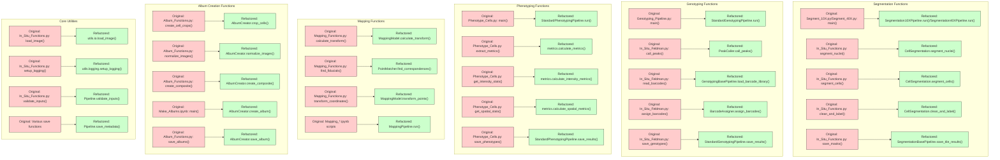

```mermaid
flowchart TD
    %% Segmentation Functions
    subgraph segmentation["Segmentation Functions"]
        OS1["Original: Segment_10X.py/Segment_40X.py: main()"] --> NS1["Refactored: Segmentation10XPipeline.run()/Segmentation40XPipeline.run()"]
        OS2["Original: In_Situ_Functions.py: segment_nuclei()"] --> NS2["Refactored: CellSegmentation.segment_nuclei()"]
        OS3["Original: In_Situ_Functions.py: segment_cells()"] --> NS3["Refactored: CellSegmentation.segment_cells()"]
        OS4["Original: In_Situ_Functions.py: clean_and_label()"] --> NS4["Refactored: CellSegmentation.clean_and_label()"]
        OS5["Original: In_Situ_Functions.py: save_masks()"] --> NS5["Refactored: SegmentationBasePipeline.save_tile_results()"]
    end
    
    %% Genotyping Functions
    subgraph genotyping["Genotyping Functions"]
        OG1["Original: Genotyping_Pipeline.py: main()"] --> NG1["Refactored: StandardGenotypingPipeline.run()"]
        OG2["Original: In_Situ_Feldman.py: call_peaks()"] --> NG2["Refactored: PeakCaller.call_peaks()"]
        OG3["Original: In_Situ_Feldman.py: read_barcodes()"] --> NG3["Refactored: GenotypingBasePipeline.load_barcode_library()"]
        OG4["Original: In_Situ_Feldman.py: assign_barcodes()"] --> NG4["Refactored: BarcodeAssigner.assign_barcodes()"]
        OG5["Original: In_Situ_Feldman.py: save_genotypes()"] --> NG5["Refactored: StandardGenotypingPipeline.save_results()"]
    end
    
    %% Phenotyping Functions
    subgraph phenotyping["Phenotyping Functions"]
        OP1["Original: Phenotype_Cells.py: main()"] --> NP1["Refactored: StandardPhenotypingPipeline.run()"]
        OP2["Original: Phenotype_Cells.py: extract_metrics()"] --> NP2["Refactored: metrics.calculate_metrics()"]
        OP3["Original: Phenotype_Cells.py: get_intensity_stats()"] --> NP3["Refactored: metrics.calculate_intensity_metrics()"]
        OP4["Original: Phenotype_Cells.py: get_spatial_stats()"] --> NP4["Refactored: metrics.calculate_spatial_metrics()"]
        OP5["Original: Phenotype_Cells.py: save_phenotypes()"] --> NP5["Refactored: StandardPhenotypingPipeline.save_results()"]
    end
    
    %% Mapping Functions
    subgraph mapping["Mapping Functions"]
        OM1["Original: Mapping_Functions.py: calculate_transform()"] --> NM1["Refactored: MappingModel.calculate_transform()"]
        OM2["Original: Mapping_Functions.py: find_fiducials()"] --> NM2["Refactored: PointMatcher.find_correspondences()"]
        OM3["Original: Mapping_Functions.py: transform_coordinates()"] --> NM3["Refactored: MappingModel.transform_points()"]
        OM4["Original: Mapping_*.ipynb scripts"] --> NM4["Refactored: MappingPipeline.run()"]
    end
    
    %% Album Creation Functions
    subgraph albums["Album Creation Functions"]
        OA1["Original: Album_Functions.py: create_cell_crops()"] --> NA1["Refactored: AlbumCreator.crop_cells()"]
        OA2["Original: Album_Functions.py: normalize_images()"] --> NA2["Refactored: AlbumCreator.normalize_images()"]
        OA3["Original: Album_Functions.py: create_composite()"] --> NA3["Refactored: AlbumCreator.create_composite()"]
        OA4["Original: Make_Albums.ipynb: main()"] --> NA4["Refactored: AlbumCreator.create_album()"]
        OA5["Original: Album_Functions.py: save_albums()"] --> NA5["Refactored: AlbumCreator.save_album()"]
    end
    
    %% Core/Common Functions
    subgraph core["Core Utilities"]
        OU1["Original: In_Situ_Functions.py: load_image()"] --> NU1["Refactored: utils.io.load_image()"]
        OU2["Original: In_Situ_Functions.py: setup_logging()"] --> NU2["Refactored: utils.logging.setup_logging()"]
        OU3["Original: In_Situ_Functions.py: validate_inputs()"] --> NU3["Refactored: Pipeline.validate_inputs()"]
        OU4["Original: Various save functions"] --> NU4["Refactored: Pipeline.save_metadata()"]
    end
    
    %% Styling
    classDef original fill:#ffcccc,stroke:#333,stroke-width:1px
    classDef refactored fill:#ccffcc,stroke:#333,stroke-width:1px
    
    class OS1,OS2,OS3,OS4,OS5,OG1,OG2,OG3,OG4,OG5,OP1,OP2,OP3,OP4,OP5,OM1,OM2,OM3,OM4,OA1,OA2,OA3,OA4,OA5,OU1,OU2,OU3,OU4 original
    class NS1,NS2,NS3,NS4,NS5,NG1,NG2,NG3,NG4,NG5,NP1,NP2,NP3,NP4,NP5,NM1,NM2,NM3,NM4,NA1,NA2,NA3,NA4,NA5,NU1,NU2,NU3,NU4 refactored
```